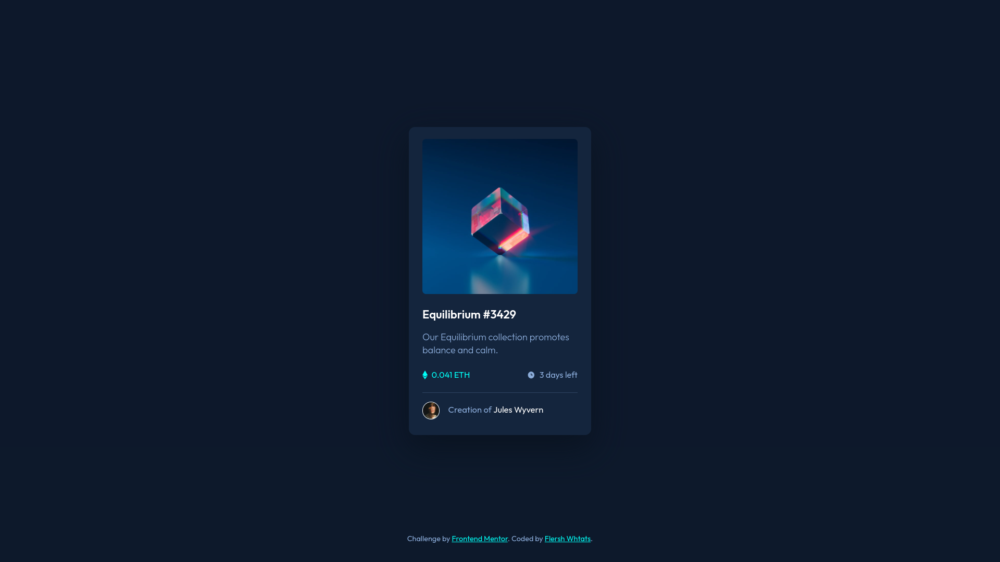

# Frontend Mentor - NFT preview card component

This is a solution to the [NFT preview card component challenge on Frontend Mentor](https://www.frontendmentor.io/solutions/nft-preview-card-component-3XPMI3Dlxi). Frontend Mentor challenges help you improve your coding skills by building realistic projects. 

### Links

- Solution URL: [https://github.com/flershwhtat/nft-preview-card-component](https://github.com/flershwhtat/nft-preview-card-component)
- Live Site URL: [https://nft-preview-card-component-flersh.netlify.app](https://nft-preview-card-component-flersh.netlify.app)

### Built with

- HTML5
- CSS
- Flexbox

## Author

- Github - [flershwhtat](https://github.com/flershwhtat)
- Frontend Mentor - [@flershwhtat](https://www.frontendmentor.io/profile/flershwhtat)
